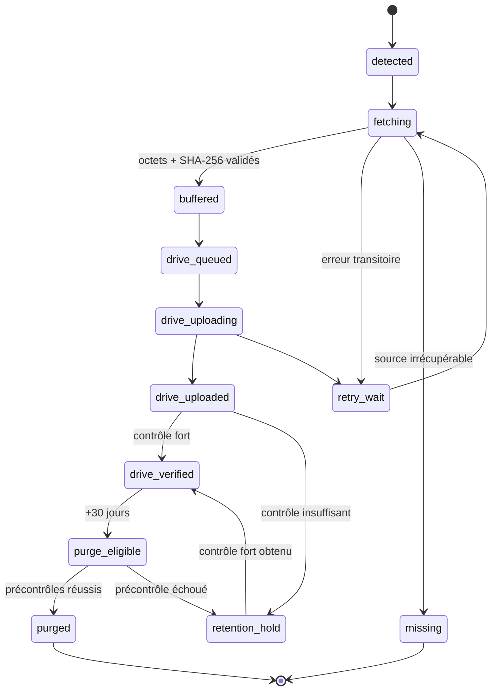
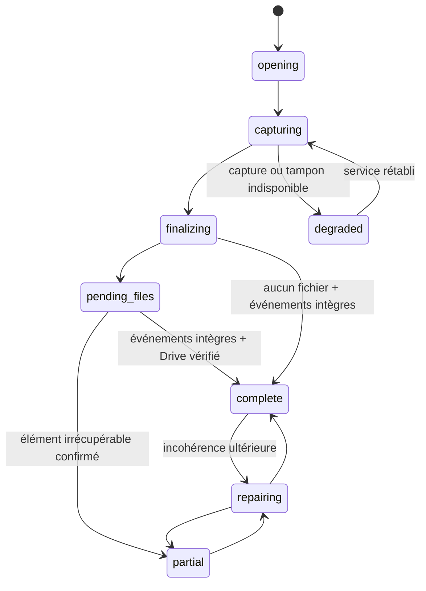

# Conversation Archive v2 — Contrat de données et plan QA iPhone

Statut : rapport intermédiaire de conception et de recette  
Périmètre : axe 1 — capture intégrale des conversations et sécurisation des fichiers  
Hors périmètre : mise à jour de ProjectOS, modification GitHub, choix définitif de l’implémentation technique

## 1. Règles non négociables

1. Une archive porte sur tout le contenu **visible** d’une conversation enregistrée : messages utilisateur, réponses finales, commentaires intermédiaires visibles, références de fichiers et erreurs visibles. Les instructions système, secrets et raisonnements internes non affichés sont exclus.
2. Un fichier n’est pas sauvegardé parce que son lien a été mémorisé. Il est sauvegardé uniquement lorsque ses octets ont été copiés dans le tampon durable et vérifiés.
3. Toute URL temporaire est téléchargée dès sa détection, avant les opérations lentes comme la réplication Drive.
4. Un `file_id`, lorsqu’il existe, est conservé pour renouveler l’URL, mais ne remplace jamais le téléchargement des octets.
5. Un chemin `sandbox:` ou un chemin de workspace Codex n’est pas durable. Tout fichier utile doit être promu dans le tampon pendant que le workspace est encore accessible.
6. Google Drive est l’archive finale. Le tampon absorbe les indisponibilités de Drive et permet une reprise idempotente.
7. La complétude est démontrée par événement et par fichier. Elle n’est jamais déduite d’un simple « upload terminé ».
8. La purge à 30 jours concerne **la copie tampon gérée par l’archiveur**, pas l’archive finale Drive, l’historique ChatGPT/Codex, la Library, ni les fichiers GitHub.
9. Le délai de 30 jours commence à `drive_verified_at`. Une copie tampon non vérifiée sur Drive n’est jamais purgée automatiquement, même si elle a plus de 30 jours.
10. Les opérations de capture, transfert, reprise et purge doivent être idempotentes : leur répétition ne crée ni perte ni doublon logique.

## 2. Identifiants et conventions

| Objet | Format recommandé | Exemple |
|---|---|---|
| Session | `SES-AAAAMMJJ-NNN` | `SES-20260807-003` |
| Événement | `<session_id>-E<6 chiffres>` | `SES-20260807-003-E000042` |
| Fichier logique | `<session_id>-F<6 chiffres>` | `SES-20260807-003-F000007` |
| Tentative de transfert | UUID | `018f…` |
| Empreinte binaire | SHA-256 hexadécimal | 64 caractères |
| Clé d’idempotence événement | `session_id + source_message_id + ordinal + content_sha256` | chaîne stable |
| Clé d’idempotence fichier | `session_id + logical_file_id + binary_sha256` | chaîne stable |

Les horodatages sont stockés en UTC au format ISO 8601 avec millisecondes. L’interface peut les afficher dans le fuseau local de l’iPhone.

## 3. Contrat de données

### 3.1 `ArchiveSession`

```json
{
  "schema_version": "2.0",
  "session_id": "SES-20260807-003",
  "source": "codex",
  "archive_policy": "automatic",
  "status": "capturing",
  "title": "Conversation Archive v2",
  "project": "ProjectOS",
  "source_conversation_id": "opaque-if-available",
  "opened_at": "2026-08-07T08:12:31.000Z",
  "last_event_at": "2026-08-07T08:18:05.000Z",
  "finalized_at": null,
  "expected_event_count": null,
  "committed_event_count": 12,
  "detected_file_count": 3,
  "buffered_file_count": 3,
  "drive_verified_file_count": 2,
  "missing_event_ordinals": [],
  "blocking_asset_ids": ["SES-20260807-003-F000003"],
  "created_by": "conversation-archive-v2"
}
```

Contraintes :

- `source` ∈ `chatgpt | codex` ;
- `archive_policy` ∈ `consented | automatic` ;
- ChatGPT exige une preuve de consentement avant le premier événement archivé ; Codex utilise la politique automatique ProjectOS ;
- `expected_event_count` peut rester nul tant que la conversation est ouverte ;
- `complete` est interdit si `missing_event_ordinals` n’est pas vide ou si un fichier bloquant n’est pas `drive_verified`.

### 3.2 `ConversationEvent`

```json
{
  "schema_version": "2.0",
  "event_id": "SES-20260807-003-E000042",
  "session_id": "SES-20260807-003",
  "ordinal": 42,
  "source_message_id": "opaque-if-available",
  "event_type": "assistant_message",
  "role": "assistant",
  "visibility": "user_visible",
  "occurred_at": "2026-08-07T08:18:05.000Z",
  "captured_at": "2026-08-07T08:18:05.220Z",
  "content_text": "Texte exact visible…",
  "content_format": "markdown",
  "content_sha256": "…",
  "asset_refs": ["SES-20260807-003-F000003"],
  "capture_status": "buffer_committed",
  "idempotency_key": "…"
}
```

`event_type` peut valoir :

- `user_message` ;
- `assistant_message` ;
- `assistant_progress` ;
- `user_file_reference` ;
- `assistant_file_reference` ;
- `tool_result_visible` ;
- `visible_error` ;
- `session_marker`.

Le texte canonique est celui affiché à l’utilisateur, sans réécriture ni résumé. `conversation.md` est une vue régénérable ; `conversation.jsonl` est le journal canonique.

### 3.3 `FileAsset`

```json
{
  "schema_version": "2.0",
  "asset_id": "SES-20260807-003-F000003",
  "session_id": "SES-20260807-003",
  "origin": "temporary_url",
  "direction": "assistant_to_user",
  "purpose": "deliverable",
  "source_event_id": "SES-20260807-003-E000042",
  "original_name": "rapport.pdf",
  "safe_name": "F000003__rapport.pdf",
  "declared_mime_type": "application/pdf",
  "detected_mime_type": "application/pdf",
  "declared_size_bytes": 420013,
  "received_size_bytes": 420013,
  "binary_sha256": "…",
  "source_locator": {
    "kind": "temporary_url",
    "url_redacted": "https://…/…",
    "file_id": "file_…",
    "sandbox_path": null,
    "workspace_path": null,
    "detected_at": "2026-08-07T08:18:05.100Z",
    "expires_at": null,
    "renewal_supported": true
  },
  "acquisition_status": "buffered",
  "replication_status": "drive_pending",
  "buffered_at": "2026-08-07T08:18:06.000Z",
  "drive_uploaded_at": null,
  "drive_verified_at": null,
  "buffer_retention_until": null,
  "purged_at": null,
  "retry_count": 0,
  "last_error": null
}
```

Valeurs de `origin` :

- `user_upload` ;
- `assistant_attachment` ;
- `codex_artifact` ;
- `sandbox_path` ;
- `workspace_path` ;
- `temporary_url` ;
- `repository_file` ;
- `external_file_link`.

Valeurs de `purpose` : `attachment | deliverable | intermediate | source | repository_change`.

Règles :

- l’URL complète susceptible de contenir un jeton n’est jamais écrite dans un journal destiné à GitHub ou affichée dans l’interface ;
- elle peut être chiffrée dans la file locale tant que le téléchargement n’est pas terminé ;
- deux fichiers homonymes conservent leur nom original dans les métadonnées, mais reçoivent un `safe_name` unique ;
- le MIME détecté et la signature binaire priment sur l’extension pour les contrôles de sécurité ;
- `repository_file` référence le commit Git canonique ; il n’est copié dans Drive que si la politique de session le demande comme livrable.

### 3.4 `ReplicaRecord`

```json
{
  "asset_id": "SES-20260807-003-F000003",
  "storage": "google_drive",
  "object_id": "drive-file-id",
  "folder_id": "drive-folder-id",
  "path_display": "ProjectOS/Conversation-Archives/…/rapport.pdf",
  "uploaded_size_bytes": 420013,
  "verification_method": "download_and_sha256",
  "verified_sha256": "…",
  "verified_at": "2026-08-07T08:30:00.000Z",
  "privacy_verified": true
}
```

Méthodes de vérification acceptables, de la plus forte à la plus faible :

1. relecture Drive complète et comparaison SHA-256 ;
2. empreinte fiable renvoyée par l’API et comparaison ;
3. taille + identifiant Drive + relecture partielle documentée.

La méthode 3 ne suffit pas pour une purge automatique. Elle maintient le fichier tampon en `retention_hold` jusqu’à une vérification forte.

### 3.5 `TransferAttempt`

```json
{
  "attempt_id": "uuid",
  "asset_id": "SES-20260807-003-F000003",
  "operation": "download_source",
  "attempt_number": 2,
  "started_at": "2026-08-07T08:19:00.000Z",
  "ended_at": "2026-08-07T08:19:01.000Z",
  "outcome": "retryable_error",
  "http_status": 403,
  "error_code": "TEMP_URL_EXPIRED",
  "next_retry_at": "2026-08-07T08:19:03.000Z",
  "bytes_transferred": 0,
  "file_id_renewal_attempted": true
}
```

Les tentatives sont append-only. Les erreurs transitoires (`timeout`, `429`, `5xx`, coupure réseau, Drive indisponible) déclenchent une reprise avec délai croissant et jitter. Un `401/403` sur URL temporaire déclenche d’abord son renouvellement lorsqu’un `file_id` existe.

### 3.6 `PurgeRecord`

```json
{
  "asset_id": "SES-20260807-003-F000003",
  "scope": "managed_buffer_copy_only",
  "eligible_at": "2026-09-06T08:30:00.000Z",
  "eligibility_checks": {
    "drive_verified": true,
    "strong_hash_match": true,
    "privacy_verified": true,
    "open_transfer_attempt": false,
    "legal_or_manual_hold": false
  },
  "purged_at": "2026-09-06T09:00:00.000Z",
  "post_purge_drive_recheck": true,
  "outcome": "purged"
}
```

## 4. Machines à états

### 4.1 Acquisition et réplication d’un fichier



Invariants :

- `buffered` exige des octets complets, une taille reçue et un SHA-256 ;
- `drive_verified` exige l’identité binaire avec le tampon ;
- `purge_eligible` exige `now >= drive_verified_at + 30 jours` ;
- `purged` ne peut viser que la copie tampon de l’archiveur ;
- toute transition est enregistrée avec cause, date et acteur ;
- une erreur permanente conduit à `missing` ou `manual_action_required`, jamais à `complete`.

### 4.2 État d’une session



Une conversation encore ouverte est `capturing`, même si tout son contenu courant est répliqué. `complete` signifie « finalisée et prouvée complète à cet instant ».

## 5. Algorithme prioritaire pour les liens temporaires

1. Détecter la référence explicite au fichier dans l’événement visible.
2. Créer immédiatement `FileAsset` et persister les métadonnées disponibles.
3. Placer la demande dans une file **priorité critique** ; ne pas attendre Drive.
4. Télécharger en streaming vers un fichier partiel atomique.
5. Calculer SHA-256 pendant le flux et vérifier la taille annoncée si elle existe.
6. Renommer atomiquement le fichier partiel seulement après succès.
7. En cas de `401/403` :
   - avec `file_id` : demander une nouvelle URL puis reprendre ;
   - sans `file_id` : retenter immédiatement selon une courte stratégie bornée, puis signaler une action manuelle avant expiration définitive.
8. En cas d’interruption : reprendre par `Range` si la source le supporte ; sinon recommencer dans un nouveau fichier partiel.
9. Ne jamais concaténer aveuglément deux téléchargements partiels.
10. Après `buffered`, répliquer vers Drive de façon asynchrone.

## 6. Déduplication sans perte d’information

- La déduplication physique s’effectue sur `binary_sha256 + received_size_bytes`.
- Chaque occurrence dans la conversation conserve néanmoins son propre `FileAsset` ou au minimum son propre lien logique `event ↔ asset`.
- Deux fichiers identiques fournis à des moments différents restent deux occurrences auditables, même s’ils partagent un seul blob tampon.
- Deux fichiers portant le même nom mais ayant des empreintes différentes ne sont jamais fusionnés.
- Une nouvelle tentative portant la même clé d’idempotence ne crée pas un second fichier Drive.
- Si Drive contient déjà le bon objet vérifié, la tentative passe directement à `drive_verified` et journalise `deduplicated=true`.

## 7. Politique de rétention et purge à 30 jours

### 7.1 Portée

La purge automatique supprime uniquement :

- le blob binaire du tampon géré par l’archiveur ;
- ses fragments de téléchargement devenus inutiles ;
- les URL temporaires ou jetons chiffrés encore présents dans la file.

Elle conserve :

- l’archive finale sur Google Drive ;
- `conversation.md`, `conversation.jsonl`, `MANIFEST.json` et `RECOVERY_REPORT.json` sur Drive ;
- les métadonnées minimales de preuve de purge ;
- l’index et la synthèse GitHub ;
- les sources que l’archiveur ne possède pas, notamment ChatGPT Library, l’historique natif, GitHub ou les espaces de travail externes.

### 7.2 Date et conditions

```text
buffer_retention_until = drive_verified_at + 30 jours calendaires
```

La purge est autorisée seulement si les six conditions sont vraies :

1. objet Drive encore présent ;
2. taille identique ;
3. SHA-256 identique obtenu par contrôle fort ;
4. confidentialité/partage conformes ;
5. aucune tentative ouverte ni réparation en cours ;
6. aucune suspension manuelle ou juridique.

Si Drive est inaccessible le jour de purge, la purge est reportée. Si la copie Drive a disparu ou diffère, le tampon repasse en `retention_hold`, une réparation est tentée et une alerte est produite. Après purge, une relecture Drive est réalisée et enregistrée ; l’échec ouvre un incident mais ne peut évidemment plus restaurer le tampon supprimé, d’où le précontrôle fort obligatoire.

## 8. Critères d’acceptation

### 8.1 Conversation intégrale

- **AC-CONV-01** — Tous les événements visibles sont présents dans l’ordre exact, sans trou d’ordinal.
- **AC-CONV-02** — Le texte stocké est identique au texte visible, modulo une normalisation documentée des fins de ligne.
- **AC-CONV-03** — Les commentaires intermédiaires visibles de Codex sont inclus.
- **AC-CONV-04** — Une reprise après fermeture n’écrase ni ne duplique les événements déjà engagés.
- **AC-CONV-05** — `conversation.md` peut être régénéré à l’identique depuis `conversation.jsonl`.
- **AC-CONV-06** — Une session longue reste exacte après compactage du contexte, car les tours antérieurs ont été engagés avant compactage.

### 8.2 Fichiers

- **AC-FILE-01** — Toute pièce jointe utilisateur détectée a une entrée de manifeste et une copie binaire vérifiée.
- **AC-FILE-02** — Tout fichier attaché ou livré par ChatGPT/Codex a une entrée de manifeste et une copie binaire vérifiée.
- **AC-FILE-03** — Tout lien `sandbox:` utile est copié avant la fin du workspace.
- **AC-FILE-04** — Toute URL temporaire est priorisée ; son succès exige SHA-256 et taille reçue.
- **AC-FILE-05** — Avec `file_id`, l’expiration de l’URL déclenche son renouvellement sans intervention si la plateforme le permet.
- **AC-FILE-06** — Sans `file_id`, l’échec produit immédiatement un statut critique et une consigne explicite ; il n’est jamais masqué.
- **AC-FILE-07** — Deux homonymes différents sont conservés séparément ; deux binaires identiques sont dédupliqués physiquement sans perdre leurs occurrences logiques.
- **AC-FILE-08** — Aucun secret d’URL temporaire n’apparaît dans GitHub, les journaux exportés ou l’interface.

### 8.3 Drive, reprise et purge

- **AC-DRV-01** — Une indisponibilité Drive n’empêche pas un fichier déjà `buffered` d’être sécurisé.
- **AC-DRV-02** — La reprise après retour de Drive ne crée pas de doublon.
- **AC-DRV-03** — `drive_verified` repose sur une preuve d’identité binaire forte.
- **AC-DRV-04** — Une session n’est `complete` que lorsque tous les fichiers bloquants sont `drive_verified`.
- **AC-RET-01** — Aucune copie tampon n’est supprimée avant `drive_verified_at + 30 jours`.
- **AC-RET-02** — Aucun tampon non vérifié sur Drive n’est automatiquement supprimé, quel que soit son âge.
- **AC-RET-03** — La purge ne supprime jamais l’archive Drive ni une source externe.
- **AC-RET-04** — Chaque purge laisse une preuve minimale vérifiable dans `PurgeRecord`.

### 8.4 iPhone et exploitation

- **AC-IOS-01** — L’état survit au changement d’application, au verrouillage et à la fermeture forcée de l’interface.
- **AC-IOS-02** — Au retour dans l’application, la progression réelle est affichée sans recommencer les fichiers validés.
- **AC-IOS-03** — L’utilisateur peut distinguer clairement `capturé`, `tamponné`, `Drive en attente`, `Drive vérifié` et `action requise`.
- **AC-IOS-04** — Les actions `Réessayer`, `Vérifier` et `Ouvrir dans Drive` fonctionnent depuis l’iPhone.
- **AC-IOS-05** — La fin présente une synthèse : événements, fichiers, octets, anomalies, statut Drive et date de purge prévue.

## 9. Matrice QA sur iPhone réel

La recette est exécutée sur l’iPhone cible, dans l’app ChatGPT et/ou Safari selon le parcours retenu, avec Wi-Fi puis réseau cellulaire. Les preuves comprennent captures d’écran, export du manifeste, empreintes calculées et contrôle manuel du dossier Drive.

| ID | Scénario | Préparation / action réelle | Résultat attendu | Preuve |
|---|---|---|---|---|
| IOS-001 | Conversation texte courte | 5 tours alternés, finaliser | 10 messages visibles ordonnés, zéro trou | comparaison écran / JSONL |
| IOS-002 | Conversation longue | ≥50 tours avec commentaires Codex visibles | contenu initial conservé mot pour mot après compactage | diff transcript / JSONL |
| IOS-003 | Pièce utilisateur unique | joindre un PDF depuis Fichiers | PDF `buffered`, puis `drive_verified` | SHA-256 local = Drive |
| IOS-004 | Plusieurs types utilisateur | joindre image, DOCX, ZIP et texte | 4 actifs distincts, MIME réel enregistré | manifeste + ouverture Drive |
| IOS-005 | Fichier assistant | demander un PDF téléchargeable | fichier copié avant statut complet | SHA-256 + événement lié |
| IOS-006 | Plusieurs livrables Codex | produire code, ZIP et rapport | chaque livrable utile promu hors workspace | manifeste + Drive |
| IOS-007 | Lien `sandbox:` | ouvrir puis quitter la conversation | octets sauvegardés avant expiration du sandbox | fichier Drive ouvrable |
| IOS-008 | Workspace Codex | créer un fichier non Git temporaire utile | promotion automatique ou statut bloquant explicite | journal d’acquisition |
| IOS-009 | URL temporaire + `file_id` valide | fournir un lien téléchargeable | téléchargement prioritaire immédiat | timestamps détection/tampon |
| IOS-010 | URL expirée + `file_id` | faire expirer l’URL avant récupération | renouvellement, téléchargement, aucune action manuelle si supporté | tentative 403 puis succès |
| IOS-011 | URL temporaire sans `file_id` | couper le réseau juste après détection | reprise immédiate si lien encore valide, sinon alerte critique | `RECOVERY_REPORT` |
| IOS-012 | Homonymes différents | joindre deux `rapport.pdf` différents | deux noms sûrs, deux SHA distincts | contenu des deux fichiers |
| IOS-013 | Doublon binaire | joindre deux fois le même fichier | deux occurrences logiques, un seul blob physique si prévu | registre de déduplication |
| IOS-014 | Interruption téléchargement | couper Wi-Fi pendant gros ZIP | reprise sûre ou redémarrage propre, jamais fichier corrompu validé | hash + tentatives |
| IOS-015 | Changement d’app | passer 2 minutes dans une autre app | état persistant ; reprise sans doublon au retour | capture avant/après |
| IOS-016 | Verrouillage iPhone | verrouiller 5 minutes pendant file d’attente | état conservé ; reprise explicite si iOS suspend l’exécution | journal horodaté |
| IOS-017 | Fermeture forcée | tuer l’app pendant `fetching` | fichier partiel non validé ; reprise sûre au lancement | absence de faux `buffered` |
| IOS-018 | Drive indisponible | révoquer/couper temporairement l’accès Drive | fichier reste `buffered`, session `pending_files` | tampon + statut UI |
| IOS-019 | Retour de Drive | restaurer l’accès puis `Réessayer` | transfert unique et `drive_verified` | un objet Drive, hash identique |
| IOS-020 | Timeout Drive | simuler réponse lente | timeout borné, interface non bloquée, nouvelle tentative planifiée | journal de tentative |
| IOS-021 | Crash après upload | interrompre entre upload et validation | réconciliation retrouve l’objet sans doublon | même `object_id` |
| IOS-022 | Fichier Drive altéré | remplacer l’objet avant vérification | hash différent, `retention_hold`, jamais `complete` | anomalie manifeste |
| IOS-023 | Reprise session | fermer puis rouvrir une conversation active | même `session_id`, ordinal suivant correct | journal d’événements |
| IOS-024 | Réessai multiple | taper rapidement plusieurs fois `Réessayer` | verrou/idempotence, un seul transfert actif | tentatives + Drive |
| IOS-025 | Réseau cellulaire | répéter PDF + ZIP hors Wi-Fi | mêmes garanties ; indication claire des volumes | hash + relevé UI |
| IOS-026 | Espace insuffisant | remplir le tampon presque à saturation | refus propre avant téléchargement ou éviction sûre non bloquante | alerte, aucune perte silencieuse |
| IOS-027 | Nom malveillant | fichier `../rapport?.pdf` | nom neutralisé, original conservé en métadonnée | chemin sûr |
| IOS-028 | MIME trompeur | exécutable renommé `.pdf` | signature détectée, quarantinée, non ouverte automatiquement | statut sécurité |
| IOS-029 | Purge avant 30 jours | déclencher manuellement le job à J+29 | aucune suppression | `PurgeRecord` refusé |
| IOS-030 | Purge à J+30 vérifiée | avancer horloge de test après contrôle Drive fort | seul blob tampon supprimé, Drive intact | preuve purge + fichier Drive |
| IOS-031 | Purge J+30, Drive hors ligne | lancer purge sans accès Drive | purge reportée, `retention_hold` | blob toujours présent |
| IOS-032 | Purge J+30, hash Drive différent | altérer Drive puis lancer purge | aucune suppression ; incident et réparation | comparaison de hash |
| IOS-033 | Purge de fragments | laisser fragments anciens après réussite | fragments liés supprimés avec preuve | inventaire tampon |
| IOS-034 | Synthèse finale | terminer session mixte | compteur exact, anomalies, lien Drive, purge prévue | capture écran finale |
| IOS-035 | Récupération complète | partir uniquement du dossier Drive | reconstruire transcript lisible et ouvrir tous les fichiers | exercice de restauration |

## 10. Protocole de preuve et verdict

Chaque cas produit :

- version de l’app et d’iOS ;
- réseau utilisé ;
- heure de début et de fin ;
- identifiants session/événements/fichiers ;
- résultat `PASS | FAIL | BLOCKED` ;
- capture ou journal pertinent ;
- empreinte source, tampon et Drive lorsque applicable ;
- anomalie et procédure de reproduction en cas d’échec.

### Seuil MVP

Le MVP est acceptable pour un pilote limité si `IOS-001`, `003`, `005`, `007`, `009`, `011`, `014`, `017`, `018`, `019`, `021`, `023` et `035` réussissent. La purge automatique reste désactivée au MVP tant que `IOS-029` à `033` n’ont pas tous réussi.

### Seuil production

Le système est acceptable en production lorsque :

- tous les critères `AC-*` sont satisfaits ;
- tous les tests critiques réussissent sur Wi-Fi et réseau cellulaire ;
- aucun défaut ouvert ne peut provoquer une perte silencieuse ou une purge prématurée ;
- un exercice de restauration complet depuis Drive réussit ;
- la purge à 30 jours est activée seulement après validation des cinq tests de rétention ;
- une observation réelle de 24 heures ne révèle ni doublon, ni trou d’événement, ni transfert bloqué sans alerte.

## 11. Risques à lever par preuve technique

1. L’interface ChatGPT/Codex expose-t-elle réellement tous les événements visibles et références de fichiers au collecteur au moment utile ?
2. Un `file_id` permet-il effectivement de renouveler toutes les URL temporaires concernées, ou seulement certains types de fichiers ?
3. Les fichiers ChatGPT Library sont-ils accessibles programmatiquement au workflow retenu, ou seulement récupérables par interaction utilisateur ?
4. Le connecteur Drive permet-il une vérification SHA-256 forte après upload pour tous les formats, y compris les conversions en documents Google natifs ?
5. Quelle persistance réelle reste disponible quand iOS suspend ou tue l’application ?
6. Le tampon final sera-t-il local iCloud, Library, stockage d’objet ou combinaison de ces moyens ?

Tant que ces points ne sont pas démontrés, ils doivent apparaître comme hypothèses de test et non comme capacités garanties.
